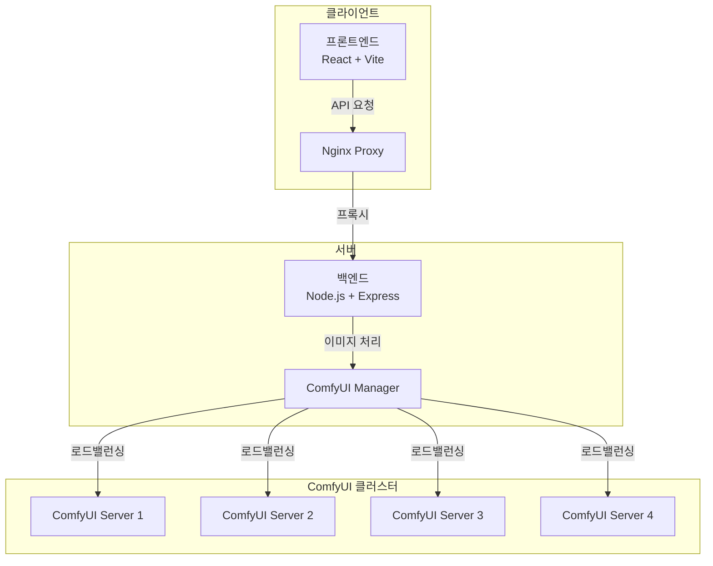

# ForSeller - AI 기반 이미지 가공 서비스 (운영 종료)


## 프로젝트 개요

ForSeller는 쇼핑몰 셀러를 위한 AI 기반 이미지 가공 서비스입니다. 대량의 상품 이미지를 한 번에 처리할 수 있으며, 배경 제거, 스튜디오 모드 변환 등 다양한 기능을 제공합니다.

### 주요 특징
- 최대 50장 이미지 동시 처리
- AI 기반 정교한 배경 제거
- 스튜디오 촬영 효과 적용
- 실시간 처리 상태 모니터링
- 로드 밸런싱을 통한 빠른 처리 속도

## 시스템 아키텍처

### 전체 구성도


## 기술 스택

### 프론트엔드
- React 18
- Vite
- React-dropzone
- Axios
- JSZip

### 백엔드
- Node.js
- Express
- Multer (파일 업로드)
- Express-rate-limit (요청 제한)
- Docker & Docker Compose

### 인프라
- Nginx (리버스 프록시)
- ComfyUI (AI 이미지 처리)
- Docker Container

## 주요 기능

### 1. 대량 이미지 처리
- 최대 50장 동시 업로드
- 드래그 앤 드롭 지원
- 실시간 처리 상태 표시
- 일괄 다운로드

### 2. AI 배경 제거
- 투명 배경 변환
- 커스텀 배경 적용
- 정교한 경계선 처리

### 3. 스튜디오 모드
- 전문 스튜디오 촬영 효과
- 조명 및 그림자 최적화
- 상품 이미지 품질 개선

### 4. 시스템 관리
- IP 기반 요청 제한
- 로드 밸런싱
- 실시간 서버 상태 모니터링

## 트러블 슈팅

### 1. AI 모델 최적화를 통한 처리 속도 개선

**문제 상황**
- 대량의 이미지 처리 과정에서 IC-Light Diffusion 모델 사용으로 인한 과도한 처리 시간 소요
- 이미지당 평균 15초의 처리 시간 필요


**해결 방안**
- 원인 분석: IC-Light는 텍스트 프롬프트 기반의 Diffusion 모델로, 각 이미지마다 생성 과정이 필요
- BRIA AI사의 RMBG-1.4 모델로 전환하여 처리 속도 개선
- IC-Light 모델은 '스튜디오 모드' 기능으로 분리하여 활용

**개선 결과**
- 이미지당 처리 시간 15초 → 1.8초로 약 85% 개선
- 사용자 경험 향상 및 서버 리소스 효율화

  


### 2. SSE를 활용한 실시간 진행률 표시

**문제 상황**
- 대량 이미지(최대 50장) 처리 시 작업 진행 상태 확인 불가
- 새로고침 시 진행 중인 작업 손실
- 사용자 이탈률 증가

**해결 방안**
- WebSocket 대신 서버→클라이언트 단방향 통신이 가능한 SSE(Server-Sent Events) 도입
- 진행 단계별 상태 전송 구현:
  - 이미지 업로드 시작 (10%)
  - 워크플로우 전송 (50%)
  - 결과 대기 (90%)
  - 완료 (100%)

**개선 결과**
- 실시간 진행률 시각화로 사용자 경험 개선
- 작업 중단 없는 안정적인 처리 가능
- 사용자 이탈률 감소

  


### 3. Node.js 기반 로드 밸런싱 구현

**문제 상황**
- ComfyUI의 순차적 이미지 처리로 인한 대량 작업 시 성능 저하
- 다중 서버 환경에서의 복잡한 응답 처리

**해결 방안**
- NGINX 로드 밸런싱 대신 Node.js 백엔드에서 직접 로드 밸런싱 구현
- 4개의 ComfyUI 서버에 요청을 균등 분배하는 비동기 처리 방식 도입
- 예시: 20개 요청을 4개 서버에 5개씩 분배

**개선 결과**
- 처리 속도 4배 향상
- 안정적인 서버 운영
- 확장 가능한 아키텍처 구현


## 시스템 특징

### 확장성
- Docker 기반 마이크로서비스 아키텍처
- 수평적 확장 가능한 ComfyUI 클러스터
- 로드 밸런싱을 통한 부하 분산

### 안정성
- 서버 헬스 체크
- 자동 페일오버
- 에러 핸들링 및 복구

### 성능
- 이미지 병렬 처리
- 연결 유지(Keep-Alive)
- 캐시 최적화

## 설치 및 실행

1. 저장소 클론
```bash
git clone <repository-url>
cd forseller
```

2. 환경 변수 설정
```bash
# .env 파일 생성
cp .env.example .env
```

3. Docker Compose 실행
```bash
docker-compose up -d
```

## 연락처

개발자: realyoon77@gmail.com
